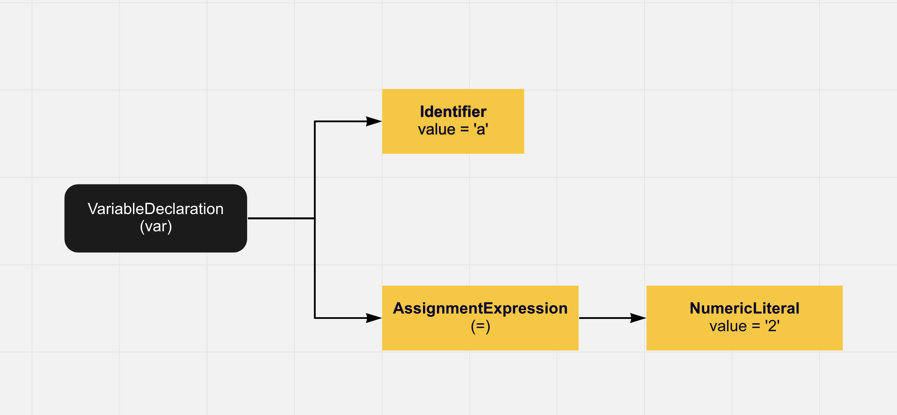

# Scope and Closures

## Scope

### TL;DR
- State: The variables used to store and retrieve values (creates _state_)
- Scope: The set of rules that dictates how we store variables and find those variables at a later time (called _scope_) 

### Step 1: How is JS compiled? 
JavaScript is a **compiled language**. What does that mean?

**Compilation (very high-level)** 
- refers to the (typically three) steps a chunk of source code goes through during the traditional compiled-language process
- **Step 1: Tokenizing/Lexing**: break up a string of characters into meangingfulchunks called "tokens".
	- `var a=2;` becomes `var`, `a`, `=`, `2`, `1=;`
- **Step 2: Parsing**: takes the array of tokens and turns it into a tree of nested elements (Abstract Syntax Tree (AST)).
	

- **Step 3: Code Generation**: process of turning AST into executable code. 

- **Why do we care?**
  - Because unlike other languages JavaScript compilation happens in microseconds before the code is executed (not in a build step ahead of time). 
  - JS is compiled _right before_ the code is executed so JS is compiling and then executing.

**Scope as a conversation**
- 
